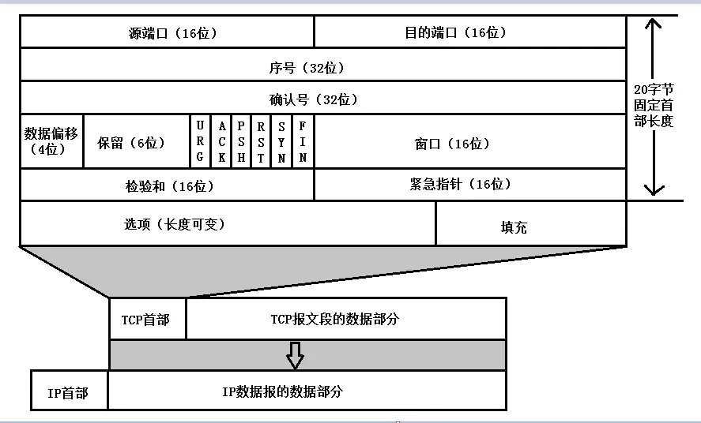

## 数据结构与算法

### 1. 数组和链表的区别

从数据结构来讲，他们都属于线性结构。数组是 **有序的** (元素的有序性)、 **连续的** (一块连续的物理内存区)，链表是 **无序的** (元素的无序性)、 **非连续的** (内存空间的非连续性)。

因其特性导致的差异：数组的优势在于数据查找访问，链表的优势在于数据的增删。

### 2. 哈希表发生哈希冲突的解决方法

* 拉链法 (链表法) ****
> 数组 + 链表 (java HashMap 便是使用拉链法解决哈希冲突的)  
> 当发生哈希冲突时，在发生冲突位置的桶生成一个单链表，  
> 具有相同散列值的元素，都放到对应下标位置的单链表中。
>   
> * 单链表过长时如何优化  
>   当链表的长度超过 **8** 后 将 **单链表** 转换为 **红黑树**

* 开放寻址法
> 即按照 **一定的条件** 重新探索一个空闲的位置放入 (装载因子过大 易造成数据堆积)。 
>  
> **1. 线性探测**     
> **2. 二次探测**  

* 再哈希法

* 建立公共溢出区

### 3. 二叉树

### 4. 排序算法

* 插入排序
* 选择排序
* 冒泡排序
* 快速排序

### 5. 链表翻转

## 计算机网络

### 1. TCP 与 UDP

TCP 与 UDP 均属于 **传输层协议**，通过分析 TCP 与 UDP 头部信息就能很好的看出两者之间的差异。 TCP 头部要比 UDP 头部字节更多，相同情况下控制开销更多，在一定时间内，传输数据的时延更大。

* TCP (Transmission Control Protocol，*传输控制协议)  
> TCP 是一个面向连接的、可靠的、基于字节流的传输层协议。  
> TCP 报文头部至少需要 **20** 个字节的开销

* UDP (User Data Protocol，*用户数据报协议)
> UDP 是一个面向无连接的、不可靠的、基于数据报文的 传输协议  
> UDP 报文头部开销为 **8** 个字节，适用于即时性、低时延的场景。

### 2. TCP的三次握手与四次挥手

* 三次握手

 * 为什么需要三次握手，两次或者四次不可以么
 > 需要同时确保 发送方 与 接收方 都具有接收与发送的能力。两次不能完全确保，四次稍显多余。
 
 * 第三次握手可以携带数据么
 > 第三次握手的时候其实就可以携带数据了，因为发送请求连接端已经能确认 接收端 的收发能力。

* 四次挥手

  * 为什么是四次挥手

### 3. TCP如何保证可靠传输

* 数据的合理分包与编号排序
> 

* 确认应答与丢包超时后的重传
* 数据校验
* 流量控制 滑动窗口
* 拥塞控制

### 4. HTTP、HTTPS

## 进程、线程

### 1. 进程和线程的区别

### 2. iOS 当中的多线程

* NSThread
> 是一种轻量级别的、苹果基于 pthread 进行面向对象封装的多线程技术。  
> 可以较方便的获取到线程对象，但同时子线程的生命周期则需要由程序员自己管控。实际项目中使用其实现多线程的情况较少。

	* 主要使用
		1. 获取主线程 与 获取当前线程 对象  
		2. 开启常驻线程
		3. performSelectorInBackground
	
* GCD ( Grand Central Dispatch ) ****
> 是 Apple 为多核的并行运算提出的解决方案，GCD 会自动管理线程的生命周期，开发者只需要关心要执行的任务而不用考虑任何线程管理的相关代码。  

	* 任务  ( 放入Block 里的代码块 )  
		1. 同步执行任务 ( sync )  
		   阻塞当前线程，不具备开启线程的能力。**任务调度在当前所在线程执行。**
		2. 异步执行任务 ( async )  
		   不会阻塞线程，具备开启线程的能力 ( 在主队列执行时不会开启线程 )
	
	* 队列  
		1. 串行队列  
		   加入串行队列的任务 ，会遵循 FIFO 的原则进行执行调度。**一定是等到上一个加入队列的任务执行完成后，才会再次取出队列里的任务进行调度执行。**
		2. 并行队列  
		    加入并行队列的任务，一样会遵循 FIFO 的原则进行执行调度。

* NSOperation、NSOperationQueue
> 底层是基于 GCD 进行面向对象封装的多线程技术，

### 3. Runloop

本质是一个 “高级的” `do-while` 循环。有事做事，无事休眠等待。与线程是一一对应的关系，每个线程都有且只有一个 Runloop， 主线程 Runloop 默认开启，子线程 Runloop 默认不会创建，当在子线程上第一次获取 Runloop 对象时才会去创建，且默认是不开启的。 

### 4. 线程锁

* 自旋锁  
> 忙等待。

* 互斥锁
>  

* 条件锁
* 乐观锁
* 悲观锁

## Objective-C 语言相关

### 1. Objective-C 对象的本质

Objective-C 对象的本质是一个 C 语言的结构体

### 2. Runtime

### 3. Objective-C 的 **消息发送** 与 **消息转发**

### 4. KVC / KVO

* **KVC** (键值编码)  

* **KVO** (Key-Value Observing 键值观察)  

1. iOS 是通过什么方式实现对一个对象的KVO? (KVO的本质) 
> 通过 Runtime 动态派生出一个被观察对象类的子类 (NSKVONotifyin_Class)， 并将被观察对象的 **isa** 指针指向该子类。然后通过重写被观察属性的 `setter` 方法，来实现对一个对象的观察。
	

### 5. Block

Block 是 Objective-C 语言对 Close(闭包) 的一种实现，其本质是一个封装了函数调用以及调用环境的 Objective-C 对象。  

根据其内存分布可以分为三种类型的 Block：  

* NSGlobalBlock ( 全局Block )
* NSStackBlock ( 栈Block )
* NSMallocBlock ( 堆Block )

### 6. + load 和 + initialize 方法

### 7. 深拷贝 与 浅拷贝

### 8. 事件传递链 与 响应者链条

## Swift 语言相关

### 1. Swift 与 Objective-C 的区别

1、 从程序设计上来讲:   
Objective-C 是标准的面向对象编程范式，是在 C语言 的基础上扩展了面向对象的思想，万物皆对象。  
Swift 则更倾向于面向协议、面向函数式编程。  

2、值类型 与 引用类型 的使用  
Swift 中更偏向于推荐使用 `结构体` 与 `枚举` 的值类型结构，( Swift 在语言设计的时候一定程度的弱化了对于指针操作的概念，Apple 期望在 Swift 中指针能够尽量减少登场几率 )。 

3、Swift 是 **静态 强类型** 语言，Objective-C 是 **动态 弱类型** 语言

### 2. 值类型 与 引用类型

1. 值类型和引用类型最主要的区别在复制之后的结果。  
当一个值类型被复制的时候，相当于创造了一个完全独立的实例，这个实例保有属于自己的独有数据，数据不会受到其他实例的数据变化影响。

	* Swift 为何将 String、Array、Dictionary 都设计为值类型? 

### 3. 写时复制

## 项目相关 

### 1. 

-------------------------------------------

## 音视频相关

### 1. H.264 结构